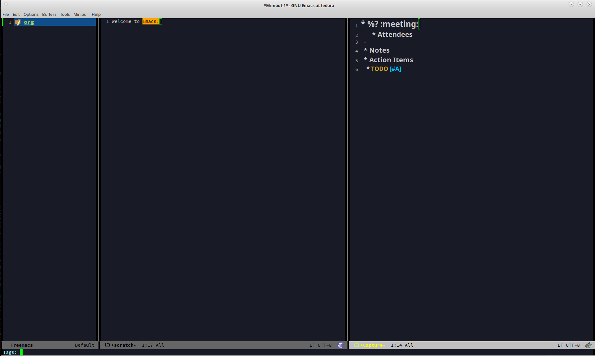
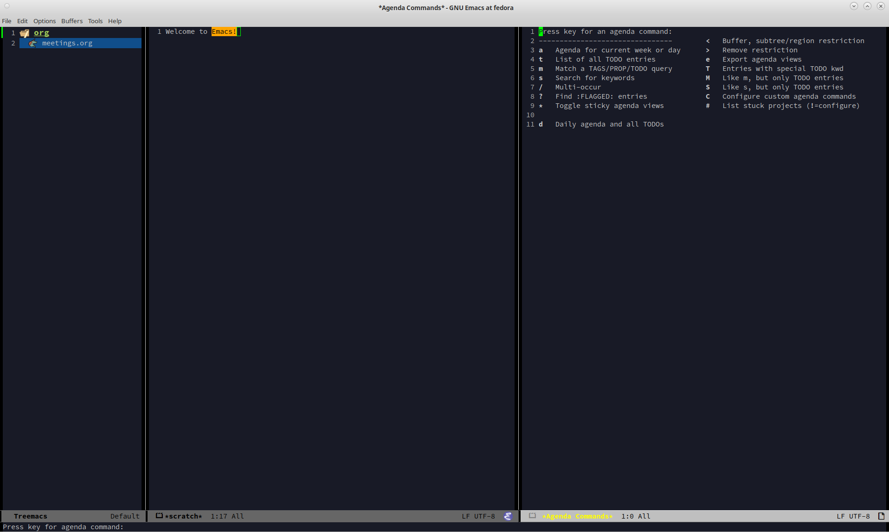
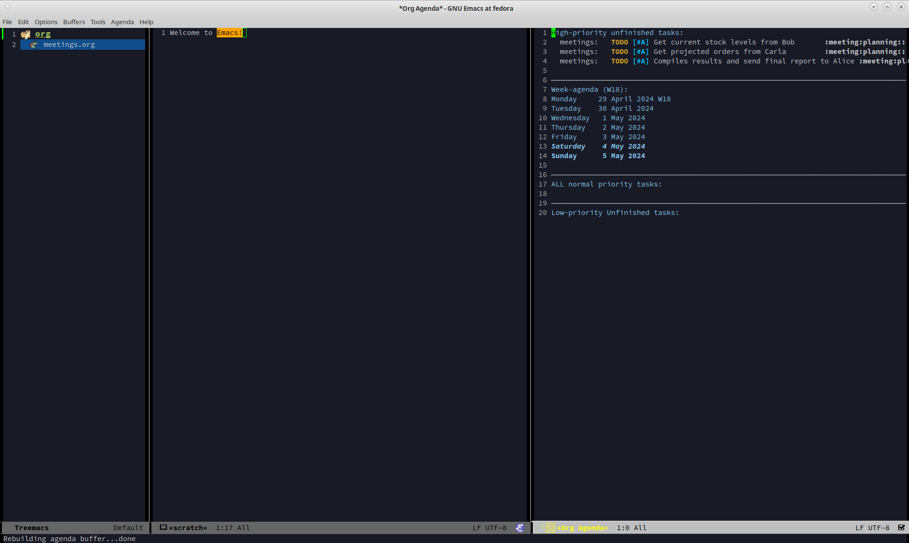
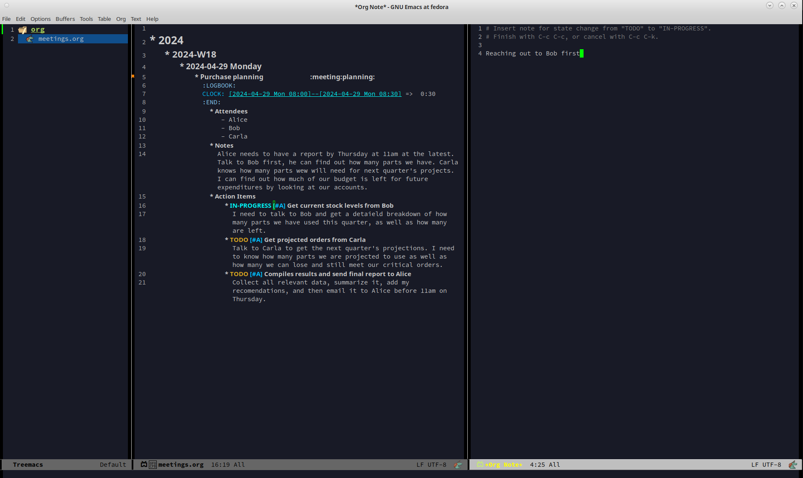
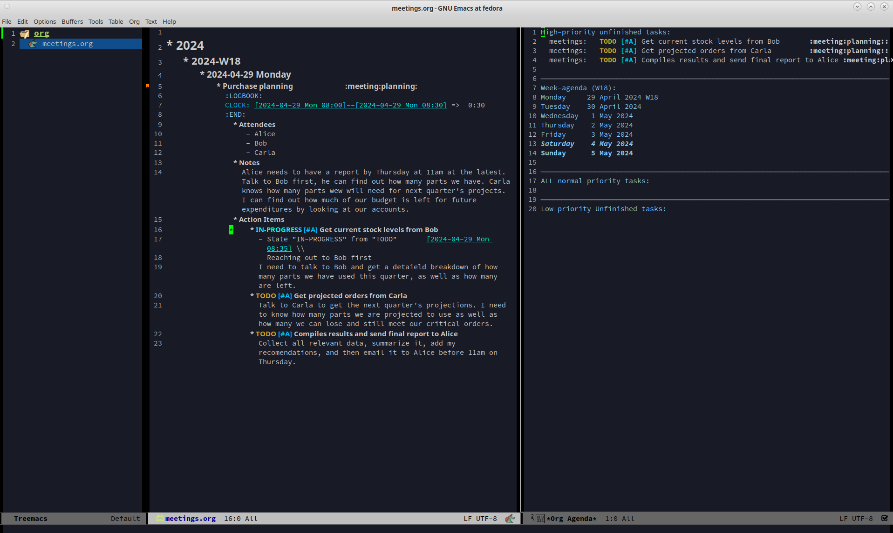
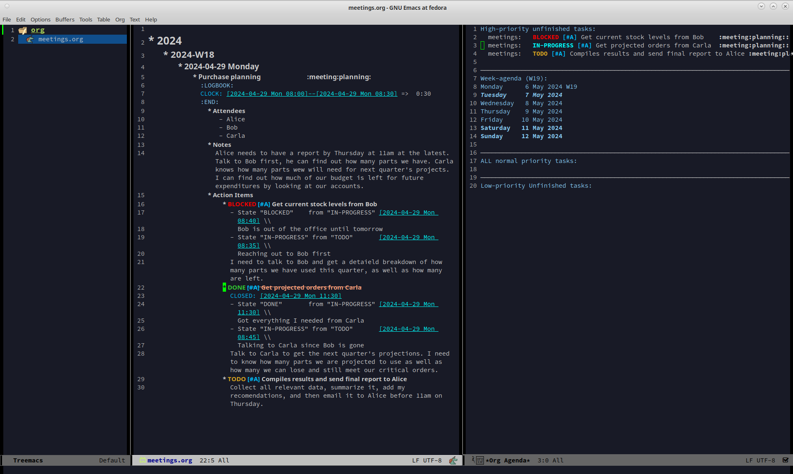
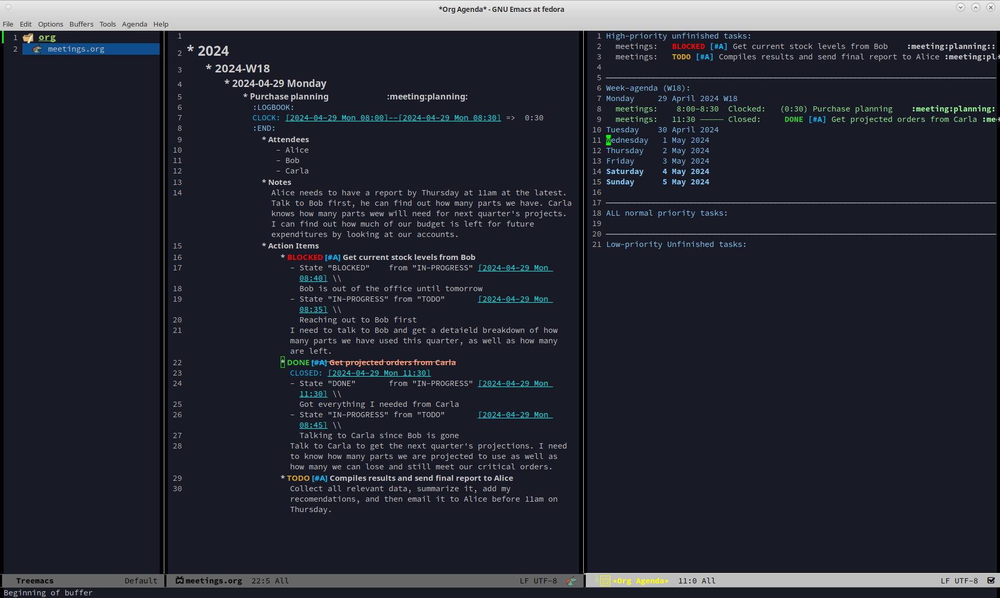
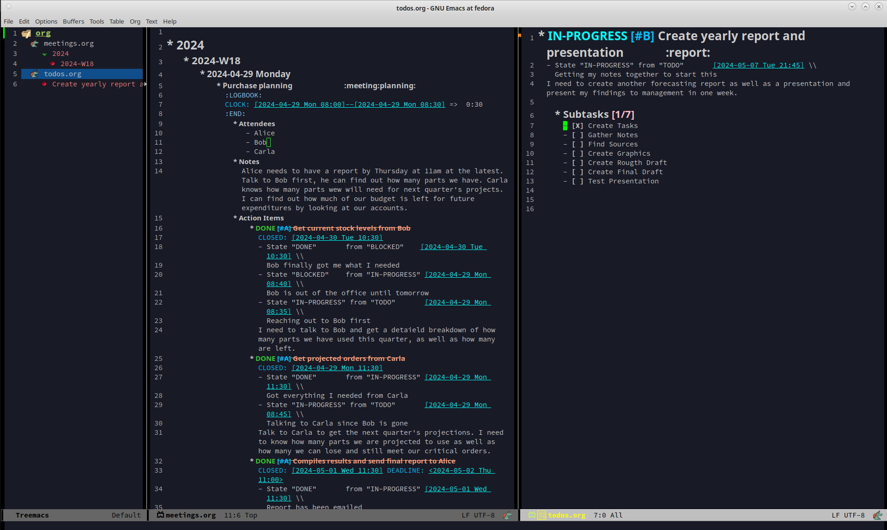
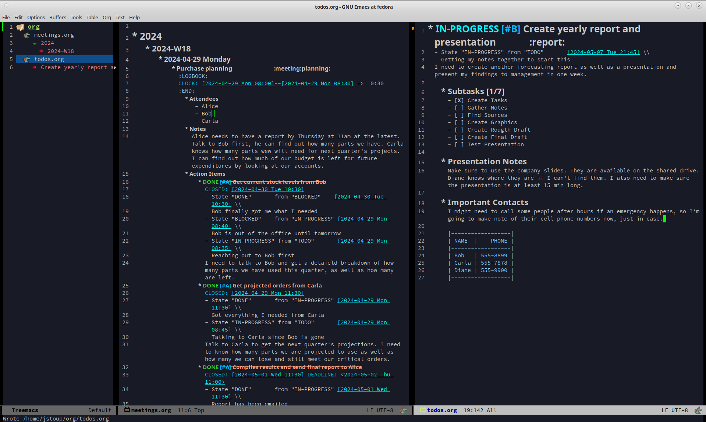

# Table of Contents

1.  [Quick Start Guide](#org405689e)
2.  [A Quick Overview](#org877af4e)
    1.  [Welcome New Org Mode Users](#orgd45b7ca)
    2.  [Org Mode with Default Settings](#orgdb5fd99)
    3.  [Org Mode with Better Defaults](#org01cf8f1)
3.  [What Is This And Why Do I Need It?](#org09db159)
    1.  [Learning Org Mode is Hard](#org9d7938e)
    2.  [About This Repo](#org4304a37)
    3.  [Summary of Features](#org7c47c76)
4.  [Installation](#org6f909fb)
    1.  [Installing the File](#org2ea7ba3)
    2.  [Selecting the Treemacs Project Root](#org32ec711)
    3.  [Light or Dark Mode](#org707644f)
    4.  [Increasing the Font Size](#org66f9d73)
    5.  [Installing Icons](#org55fd410)
5.  [I've Installed It, Now What?](#orgab0012f)
    1.  [A Brief Overview of Org Mode Syntax](#org001f06d)
    2.  [An Intro to this Org Mode Tutorial](#org1f63fef)
    3.  [Tracking Work with TODOs](#org466104d)
    4.  [Understanding the Agenda](#org19d02b8)
    5.  [Using Capture Templates](#org282fbee)
6.  [A Practical Walkthrough](#orgba2d40d)
    1.  [Monday Morning Meeting](#org68416b1)
    2.  [Filling in the Action Items](#org3733fec)
    3.  [View the Agenda](#org0967950)
    4.  [Start Working on TODO #1](#org084c72b)
    5.  [Start Working on TODO #2](#org1320e31)
    6.  [Start Working on TODO #3](#orga718600)
    7.  [A New TODO](#orga1464af)
    8.  [Working the TODO](#org39781e3)
    9.  [Make a note](#orgd2bf779)
    10. [Record a journal entry](#org6288e81)
    11. [Filtering Tags](#org0e2fbe3)
7.  [Keyboard Shortcuts List](#orgccea809)
8.  [Beyond This Tutorial](#orgc4eb3b9)
9.  [Further Reading](#org6f3ad5a)

# Quick Start Guide

For more details see below, but this is the minimum you need to make this work.

1.  Backup your `.emacs` file if you have one (`mv ~/.emacs ~/.emacs.bak`)
2.  Download the `.emacs` file from this repo
3.  Move it to your home directory (`mv ~/Downloads/.emacs ~/`)
4.  You are done, now restart `emacs` and take a look at the shortcut guide below

# A Quick Overview

## Welcome New Org Mode Users

So you want to use Org Mode, but you don't have 2 years to devote to teaching yourself Lisp? No problem. This repo was created just for you. Here you will find a simple solution that requires no additional lisp configuration on your part to work. It is ideal for users who are completely new to both Emacs and Org Mode. Simply drop this config file into your home directory, restart Emacs, and you are ready to go.

## Org Mode with Default Settings

What Org Mode looks like with the default settings:

## Org Mode with Better Defaults

And what Org Mode looks like with these Better Defaults:

# What Is This And Why Do I Need It?

## Learning Org Mode is Hard

A lot of Emacs related documentation assumes you already know quite a bit about the system and the documentation that is geared for new users is often so densely packed with information that it can be difficult to orient yourself. In short, it can be overwhelming. This is especially true for new users who don't care about "THE POWER OF EMACS(™)" but instead just want to try out Org Mode.

The good news is that Org Mode works well right from the start. The bad news is that its default settings aren't particularly user-friendly, and without significant customization, its usefulness may not be immediately apparent. I experienced this firsthand while assisting a new user with Org Mode. My Emacs configuration file is over a thousand lines long, with several hundred lines dedicated solely to Org Mode. When this new user compared their basic Org Mode setup to mine, they were disappointed by the lack of features and customization. They wondered why their setup was so plain compared to mine and how they could achieve similar results.

I sent them the link to my other Org Mode tutorial on designing your Org Mode configuration from scratch, but they didn't want that. In fact, they had no idea what they wanted. The only thing they were sure of was that they wanted it to be functional now. Not in a year, not after they had learned lisp, right now.

After some thought I decided that rather than suggesting they spend a year experimenting to understand what they needed, which would likely lead them to seek other solutions, I decided to simplify the process. I stripped down my Emacs configuration to focus solely on Org Mode—removing all unrelated features like code completion, language servers, linters, and git integration. I then streamlined this setup to be as user-friendly as possible.

After helping the new user install this pared-down configuration and providing minimal instructions, they were thrilled with the results. This experience made me realize that many others could benefit from straightforward guidance in getting started with Org Mode. If you're in the same boat, this repository might be just what you need.

## About This Repo

This repo aims to help new Emacs users become productive with Org Mode. It includes two main components: a tutorial in this README that guides you through using Org Mode with a real-world example, and a `.emacs` file that enables all the features discussed in the tutorial.

Please note, this is not a comprehensive Emacs or Org Mode tutorial. It focuses on the basics to get you started and does not cover every feature of Org Mode. There are too many features and I simply can't cover them without turning this into a small textbook. For a more in-depth understanding, I recommend referring to the [Official Org Mode Manual](https://orgmode.org/manual/).

## Summary of Features

The `.emacs` file has two main parts to it. The first part deals with improving how Org Mode looks and functions at a basic level. The second part of this configuration is the default values provided. For more info and specific implementation details, look over the `org-better-defaults.org` file in this repo. Here is a list of most of the primary enhancements provided:

**Improvements**

-   sets up default package repos
-   performance enhancements
-   auto completion
-   minor usability tweaks
-   treemacs (helps visualize headings in org files)
-   defines default org mode directory to be `~/org`
-   improved Keybindings
-   default indentation
-   auto lists
-   auto timestamps
-   expanded TODO options
-   4 custom capture templates
-   7 custom tags
-   1 custom agenda
-   colorized TODOs
-   colorized Tags
-   better fonts
-   better bullets

# Installation

These steps will walk you through how to make your version of Emacs look and feel exactly like the version shown in all the screen shots here. I would recommend new users follow these steps so everything looks the same as the tutorial to minimize confusion. However, afterwards feel free to install additional themes, fonts, or UI packages.

## Installing the File

To make your version of Emacs and Org Mode look like the screenshots below, download the `.emacs` file in this repo and either copy the contents into your existing `.emacs` file or overwrite it entirely, then restart Emacs. The first time you do this Emacs is going to download and install a bunch of files. There will be lots of install and configuration messages printed to various buffers and the entire thing might look a bit intimidating. Once you've installed everything it might look something like this:

Don't worry if yours looks different. Just let the install finish (it will stop print log messages when its done) and then close it and restart Emacs. Things should look much better at that point.

## Selecting the Treemacs Project Root

You will get a Treemacs dialog box when you launch Emacs for the first time with this new configuration. Don't be alarmed, Treemacs is just a nice file browser. Select the `org` directory located in your home directory and click OK. Don't worry if you don't already have an `org` directory, Emacs will create one for you. This is where Emacs is going to expect to find all of your `.org` files. 

Treemacs is incredibly useful not only because it displays your files, but because it also shows you the headings contained within any Org files it finds. This is a wonderful way to easily scan through an Org document. You will see the Treemacs file browser on the left hand side of all the screenshots here.

## Light or Dark Mode

I have found that most users prefer their text editor to have a dark theme and so all the screenshots here will reflect that. The theme used in this tutorial is called `deeper-blue` and it is one of the default themes that come with Emacs. To change the theme follow these steps:

1.  From the top menu select: **Options -> Customize Emacs -> Custom Themes**
2.  Check the box beside `deeper-blue`
3.  Click **Save Theme Settings**
4.  Type `q` to quit that menu
5.  Restart Emacs to properly load the theme

The font colors defined in the `.emacs` file of this repo are different for light or dark modes. By default it is set to dark mode, however if you would like to change it simply open up your `.emacs` file and find this line:

    (setq light-mode nil)

and change it to this:

    (setq light-mode t)

Then restart Emacs. The colors should now be more in keeping with a light mode style.

## Increasing the Font Size

The last UI option that you might want to change is the font size. By default Emacs sets the font size to 10 point. That is pretty small. If, like me, you are old enough that your eyes don't like that, then here is how you increase the font.

1.  From the top menu select: **Options -> Set Default Font&#x2026;**
2.  Select `Source Code Pro Regular` as the font
3.  Increase the font size to however large you would like
4.  Press the **Select** button
5.  From the top menu select: **Options -> Save Options**

That's it. From now on Emacs should default to your larger font selection.   

## Installing Icons

Part of the new defaults you have installed is support for All The Icons. This allows Emacs to add pretty icons to various parts of your UI to make things look nicer. However, before this will work you need to download the icons it will display. To do that follow these steps:

1.  Press the `Alt` key and the `x` key to bring up the command buffer
2.  Type `all-the-icons-install-fonts` and press return
3.  That's it, just give it a minute while the files download

That is it. Now your system should look like the one used in this tutorial. 

# I've Installed It, Now What?

Once you've installed the config file and restarted Emacs, you're ready to start being productive! Follow these steps: First, read through this section to grasp the key concepts. Next, go through the tutorial to see how these concepts are applied in real-world scenarios. Finally, apply what you've learned to your own notes to boost your productivity.

## A Brief Overview of Org Mode Syntax

Before we get much further we need to review Org Mode's syntax and highlight how it differs from Markdown. For example, Org Mode uses stars (`*`) to show indentation while Markdown uses the hash sign (`#`). In both cases more stars or hashes indicates deeper levels. To better illustrate this I've included a table showing the most common formats in each style.

<table border="2" cellspacing="0" cellpadding="6" rules="groups" frame="hsides">

<colgroup>
<col  class="org-left" />

<col  class="org-left" />

<col  class="org-left" />
</colgroup>
<thead>
<tr>
<th scope="col" class="org-left">FORMAT</th>
<th scope="col" class="org-left">ORG MODE</th>
<th scope="col" class="org-left">MARKDOWN</th>
</tr>
</thead>

<tbody>
<tr>
<td class="org-left">1st level heading</td>
<td class="org-left"><code>* heading 1</code></td>
<td class="org-left"><code># heading 1</code></td>
</tr>

<tr>
<td class="org-left">2nd level heading</td>
<td class="org-left"><code>** heading 2</code></td>
<td class="org-left"><code>## heading 2</code></td>
</tr>

<tr>
<td class="org-left">3rd level heading</td>
<td class="org-left"><code>*** heading 3</code></td>
<td class="org-left"><code>### heading 3</code></td>
</tr>

<tr>
<td class="org-left">Bold</td>
<td class="org-left"><code>*bold*</code></td>
<td class="org-left"><code>**bold**</code></td>
</tr>

<tr>
<td class="org-left">Italic</td>
<td class="org-left"><code>/italic/</code></td>
<td class="org-left"><code>*italic*</code></td>
</tr>

<tr>
<td class="org-left">Strike-through</td>
<td class="org-left"><code>+strike+</code></td>
<td class="org-left"><code>~~strike~~</code></td>
</tr>

<tr>
<td class="org-left">Code</td>
<td class="org-left"><code>~code~</code></td>
<td class="org-left"><code>`code`</code></td>
</tr>

<tr>
<td class="org-left">Quote</td>
<td class="org-left"><code>=quote=</code></td>
<td class="org-left"><code>&gt; quote</code></td>
</tr>

<tr>
<td class="org-left">Bullet</td>
<td class="org-left"><code>- bullet</code></td>
<td class="org-left"><code>- bullet</code></td>
</tr>

<tr>
<td class="org-left">Link</td>
<td class="org-left"><code>[[link][title]]</code></td>
<td class="org-left"><code>[title](link)</code></td>
</tr>
</tbody>
</table>

## An Intro to this Org Mode Tutorial

In this tutorial, I will use the example of managing work tasks to demonstrate Org Mode. I’ve found that realistic examples help make tutorials less abstract and more understandable. Throughout this section, I’ll explain three core concepts:

— TODO Items

-   The Agenda
-   Capture Templates

Within the context of a typical job. By the end of this tutorial, you'll know how to create TODOs, track them using the Agenda, set up custom capture templates, and use tags to organize your tasks.

We’ll start by discussing these three essential concepts, and by the end, you should have a solid grasp of Org Mode’s basics.

## Tracking Work with TODOs

TODOs are the fundamental building blocks of Org Mode. They represent tasks you want to accomplish and can include various details such as creation date, current status, priority, descriptions, checklists, and tags. TODO items help you manage work tasks, personal chores, or project steps.

By default, TODO items have two states: TODO and DONE. However, this configuration adds several additional states to support a wider range of use cases.

Here’s an example of what a TODO item entry might look like in your `todos.org` file. This is how it appears in raw text if you were to view it in a different text editor.

    * TODO Create 3rd Quarter Presentation :finance:gary:
    I need to create a presentation detailing the end of quarter numbers. The regional manager Gary will be there so it should be impressive. This presentation also needs to include projections for the next two quarters.

Here is what it looks like with the Org Mode Better Defaults:

## Understanding the Agenda

The Agenda provides a comprehensive view of all your TODOs in one place. It consolidates TODOs from various files, such as `work.org` and `personal.org`, and organizes them by status, upcoming tasks, and completed items. The Agenda also includes a calendar to show TODO deadlines and completion dates.

Here is an example of the agenda in action.

To access the Agenda, press `C-c a` and choose the view you want. For this tutorial, select the `Daily Agenda and All TODOs` option by typing `d` at the prompt. Don't worry if this seems unclear now; detailed instructions on using Org Mode will be provided in the Practical Walkthrough section.

## Using Capture Templates

To quickly recap: TODOs hold your data, and the Agenda helps you view it. But how do you enter your data efficiently? There are two methods:

1.  Manual Entry: Open the file, scroll to the end, press Return, type `* TODO`, and then enter your information. This method works and the Agenda view will display your manually entered TODOs without issue.

2.  Capture Templates: This method is more efficient, especially if you have multiple TODOs to enter. Instead of repeatedly typing the same format for each TODO, Capture Templates streamline the process.

Capture Templates allow you to quickly enter data using predefined formats, eliminating the need to manually input repetitive boilerplate text. By default, Org Mode includes only one generic task template, but this configuration offers four useful templates:

-   TODO (`t`)
-   Journal Entry (`j`)
-   Meeting (`m`)
-   Note (`n`)

Each template captures a specific type of data into a designated Org file. To use a Capture Template, press `C-c c` to open the list of available templates. Then, press the corresponding letter for the template you want to use, as indicated in the list above.

# A Practical Walkthrough

By now, you should have installed the new configuration file and reviewed the summary of Org Mode’s core features. In this walkthrough, we’ll put it all together to help you get the most out of Org Mode by managing a sample workload.

In this scenario, it’s Monday morning and you have a meeting scheduled to discuss a potential new purchase order for components needed for the next quarter. Depending on the meeting's outcome, you may need to consult with others, gather data, write a report, and submit your findings to your boss by Thursday for her review, so she can place the order by Friday. We’ll guide you through each step of this work week and demonstrate how to use Org Mode to organize your tasks and track your progress.

To start, launch Emacs. You don't need to open a specific file because the Org Mode Capture Template can be accessed from anywhere. Once Emacs opens, you’ll see two panes: Treemacs on the left showing a folder named `org`, and the `*scratch*` window on the right displaying "Welcome to Emacs!" Click in the scratch window—this is where you’ll perform most of the actions in this tutorial.

## Monday Morning Meeting

It's Monday morning, and you’re about to attend a meeting with your boss and a few coworkers to discuss a potential purchase order. Your company needs to ensure that certain expensive and complex parts are ordered on time. If there aren’t enough parts available when needed, production will halt for a month while more are made. Conversely, ordering too many parts will be costly to store until they’re needed. The meeting will help determine the best course of action. Before the meeting starts, you decide to track the details in Org Mode by creating a new meeting entry.

Here’s how to get started:

**Open Capture Template**
Press `Control` and while holding it, press `c`, then release both keys. Next, press `c` again. This launches the Capture Template. In Emacs notation, this is written as `C-c c` which is read as "press Control and c, then release both keys, and press c again".

**Select Meeting Template**
After launching the Capture Template, you’ll see four options. Press `m` to choose the Meeting template. This will open a meeting template and activate the mini buffer with the label `:Tags:`. For this example, type `planning` and press Return.

**Fill in Meeting Details**
Enter a title for your meeting. Since this is a planning meeting, type `Purchase Planning`. Under the heading Attendees, list the names of the people present. Type `Alice` (your boss), press Return, then type `Bob`, press Return, and finally type `Carla`. Press Return twice to finish the list.

**Take Meeting Notes**
Navigate to the `Notes` section and begin filling in details discussed in the meeting. For example:

`Alice needs to have a report by Thursday at 11am at the latest. Talk to Bob first, he can find out how many parts we have. Carla knows how many parts we will need for next quarter's projects. I can find out how much of our budget is left for future expenditures by looking at our accounts.`

Of course you can take whatever notes you want in whatever structure you want, but for the moment we are keeping it simple since this is a quick meeting.

**Record Action Items**
At the end of the meeting, Alice assigns you tasks: get numbers from Bob and Carla, check available funds, and write a recommendation by Thursday at 11am. These tasks should be entered under the `Action Items` heading in the template. Not every meeting will have `Action Items`, so you can delete this section if it's not applicable before saving your meeting notes.

## Filling in the Action Items

For our first action item we are going to create a TODO for finding out the current stock levels. Fill out the rest of the first action item with this `Get current stock levels from Bob` and then hit `return`. On this new line let's add some details such as `I need to talk to Bob and get a detailed breakdown of how many parts we have used this quarter as well as how many are left.`. We now have our first action item filled out.

For the next TODO type `C-return` to start a new heading and then type in `TODO [#A]` to create the TODO. Call this action item `Get projected orders from Carla` and then hit return. The details of this will be `Talk to Carla to get the next quarter's projections. I need to know how any parts we are projected to use as well as how many we can lose and still meet our critical orders.` and upon typing that, hit `C-return` one last time to create the final TODO.

Once again type in the TODO template that you used for the previous item. The title of this TODO will be `Compile results and send final report to Alice`. Hit return to get to the details of this TODO and add the lines `Collect all relevant data, summarize it, add my recommendations, and then email it to Alice before 11am on Thursday.` By the end you should have something that looks like this:

Now that all the action items have been finished and the meeting is over, we can save this meeting. To do that hit `C-c C-c` and it will file it away. Once you do that you will see a new file appear underneath the org folder on the left. This new file called `meetings.org` was created when you saved your new meeting.

## View the Agenda

At this point we have created a meeting and 3 TODOs, which means our Agenda View will now have something to display. Let's open up the Agenda View and see what it looks like. To launch the Agenda hit `C-c a` to bring up the Agenda selector.

Press `d` to activate the Daily Agenda view. Your screen should now look like this:

As you can see, the new TODO items we just created are there. Click into the Agenda view and move your cursor onto the line with your first TODO. Once it is there, hit the `TAB` key and it should jump you to the source of the TODO.

Any item in the Agenda view can always be followed back to its source. Remember, the Agenda View isn't really for editing things, it just compiles a list of things that already exist.

You might be wondering where the meeting you just created is. After all, you see the 3 action items, but where is the meeting that you were just in? Well, the meeting won't show up by default for reasons that you don't care about right now. However, there is a really useful setting we can turn on to show extra details. Navigate to the `Week-agenda` and put your cursor anywhere within the calendar. This won't work if your cursor is in the TODO sections as this is strictly a calendar setting. Once there, hit `v` to bring up the View options in the mini buffer. We want to enable the log view, so to do that, hit the `l` key. Now we see our meeting~ And as a bonus we also see the time we spent in this meeting. When you first started the capture template for the meeting a clock was started. When the meeting was saved (or filed) the clock stopped and the elapsed time was computed. The agenda view can then take this info and display it in a nicely formatted view. This is especially helpful when you have a week full of meetings. You can see at a glance how much time you spent in meetings and what those meetings involved. Hitting the `tab` key when on the same line as a meeting will take you to that entry.

## Start Working on TODO #1

You should now have 3 different TODOs to visible in your Agenda. Let's start with the first one, requesting info from Bob. If it isn't open already, go ahead and open up the `meetings.org` file and navigate to the first TODO. Right now it is still in the `TODO` state, but since we are now working it, we need to change it's state. While your cursor is on that TODO heading (it can be anywhere on the line) hit `C-c C-t` to change the state. The mini buffer will pop up and give you a bunch of options you can change it to. In our case we want to set it to `IN-PROGRESS` so hit the `i` key.

When that happens a new buffer will appear asking you to insert a note for the state change. At the prompt enter the text `Reaching out to Bob first` and hit `C-c C-c` to save the note.

Once you do this you should be returned to your original buffer where you can see that the TODO named `Get current stock levels from Bob` looks a lot different now. The state has changed from `TODO` to `IN-PROGRESS`, there is a timestamp denoting the state change, and now your note appeared too. Let's add some more details by navigating to the end of this TODO and hit return twice. On this new line we can add more notes. So enter our latest note `Emailed Bob and requested more info.` which describes the work we are doing. For the sake of this example we are going to assume you then opened up your company's email client and sent Bob an email asking for the specific data you needed for your report.

So far so good. We are making progress! Alas for us we get an auto generated email from Bob alerting us to the fact that Bob is out for the rest of the day due to a medical procedure. Since he won't return until tomorrow, we can't do anything else on this front. That shouldn't be a big problem though, since it is only Monday, he will be back on Tuesday, and the report is due Thursday, we still have time. Before we move on to another TODO item, we should really mark this to indicate what happened. To do that put your cursor back on the `IN-PROGRESS` line and hit `C-c C-t` to bring up the state change buffer. Now we are going to hit `b` to set it to blocked. Once again a we are going to add a note to describe this state change. So add the text `Bob is out of the office until tomorrow` and then hit `C-c C-c` to save it. Now our task is set to `BLOCKED` and we have a nice note describing why.

If you click in the Org Agenda pane on the right and then press `r` it will refresh your view. Doing so will now show that your first TODO is blocked while the others remain in their default state. Since we can't do anything more here, let's move on to our next TODO item.

## Start Working on TODO #2

We hit a dead end on our first TODO so now we are moving on to the second task. Just like in the previous TODO we want to change the state from `TODO` to `IN-PROGRESS` and add a note. Reread the previous section if you forgot how to do that. For the note you can use `Talking to Carla since Bob is gone` and then save it like you did the last one. So at this point we have 3 TODOs that are all in different states. Click over to your Agenda pane (if you closed it you can easily reopen it with `C-c a d`) and then type `r` to refresh the view. You should now see that your 3 TODOs are indeed all in different states.

As we did before, navigate to the end of the body of this TODO, hit return twice, and update it with what you are currently doing. Here we could add something like `Emailing Carla for her data while I wait for Bob to get back to me.` which summarizes the steps you are taking. Once again we assume that you contacted Carla over your company's email system and requested the information you require. However this time we are in luck because Carla responds fairly quickly with a link to the company's intranet where the data you want is stored. You click on the link, view the data, extract what you need, and add it to the Word document you working on. Of course, you could write everything in Org Mode and then export it to one of a dozen formats (and in fact this is what I do for my job) but for beginners I would use Org to track my notes and then something like Word to format the actual document.

It is important to note that Carla sent us a very important piece of information (the URL to the document) that is only contained in her email. While this is fine for today's task, this might be a document we want to reference later. We could save it to our local file system, bookmark it in our browser, or flag the email, but all of those solutions lack context. It is incumbent on you to remember the details of why you have this file saved. We could just copy and past the URL into our notes, but there is a better solution.

The URL in question is `http:intranet.company.com/financial/reports/Q3-reports.xls` and we want to save this to our current TODO. Start by copying the URL and then navigating to the end of the TODO. Hit return twice to start a new line and then type `C-c C-l` to create a new link. The mini buffer will appear with link options, but you are going to type `C-y` to paste your copied URL in. Once it is pasted, hit return. Now the mini buffer will prompt you to enter a description. Here you can type `Intranet link to Carla's planning document` and hit return. This is now a functioning URL that can be clicked on to open the link in your default web browser.

Since Carla has responded with the information we needed and we logged the results of that conversation, this TODO is complete. All we should have to do is mark it as `DONE` and we can move to something else. To mark it as done go to the `IN-PROGRESS` line and hit `C-c C-t` to open up the state selector. From here type `d` to select done. Enter a note such as `Got everything I needed from Carla` and then hit `C-c C-c` to save it.

At this point if you look in the Agenda view and press `r` you will see your 1st TODO that is blocked and your 3rd TODO that you haven't started, but where is your 2nd TODO? The completed item is there, it just isn't shown by default. Move your cursor to somewhere in the Calendar (it won't work if you are in one of the TODO lists) and press `v` to bring up the view buffer.

From there hit `l` to enable the log view. Now you will see two things. First, you will see your TODO item that you recently completed and second you will notice that your meeting has appeared! And as a bonus, the time you spent in this meeting appears beside it. You can easily filter your meetings to see how your week looks like as well as produce reports showing how much time you spend in meetings.

## Start Working on TODO #3

Before we do any work on this task we need to update the meta data associated with it. If you recall from the description this is due on Thursday (remember in this example it is Monday) at 11am. And while it is good that we recorded this deadline in the body of this TODO, it would be even better if there was a way of integrating this information into our TODO so it could be tracked in the Agenda View. Well good news for us, there is a way of handling deadlines.

Start by navigating to the third and final action item called `Compile results and send final report to Alice` and hit `C-c C-d` to bring up the deadline selector. Now there are several different ways we could enter a date. We could type it out in one of several formats or we could click on the desired day in the calendar up top. However, we are lazy so we are going to specify the deadline in the easy manner possible. Since it is Monday and we want to make our deadline for Thursday at 11am, when the mini buffer appears so we can select a date, simply enter `+3d 11am` and hit return. This creates a deadline 3 days in the future at 11am. Now when we refresh the Agenda View we will see that this TODO is special! Because it has a deadline marked on it.

We are going to assume that Bob has returned on Tuesday and gotten us the information we need. So in that case we can change the first TODO from `BLOCKED` and to `DONE`. At this point we can actually start work on the 3rd TODO.

So, the deadline has been added so go ahead and set the state to `IN-PROGRESS` just like we've done twice before. Add a note of your choice explaining what you started working on. After the state has been changed we could add additional notes to this TODO that might describe the order we wanted our report to be in, a list of graphs and tables to include, or links to templates that should be used for these types of company reports. You can also make new subheadings by hitting `C=return` and then hitting `tab` to move the heading over. Subheadings should be labeled in ways that make sense to your task. You can easily rearrange headings by holding the `alt` key and pressing the `up` or `down` arrow.

## A New TODO

At this point in the tutorial we will assume that two days have passed and you completed your report and sent it to Alice. You can now close those remaining TODOs and then refresh your Agenda to verify that they are closed. Now that all of our current tasks are complete we can focus on a new email from Alice. In it she tells us that she liked our report so much that she wants us to generate another report that forecasts the purchasing requirements of the next fiscal year. It also needs to have more details, more graphics, and should be presented to management in a week at the end of the month planning meeting. Since this new task didn't come in a meeting we are going to create a new TODO using the TODO capture template.

Fire up the Capture Template with `C-c c` only this time hit `t` to create a new TODO. For the tags in the mini buffer put `report` and hit return. You will now see a new TODO template and your cursor will be on the heading line. Now we can enter a heading. Type in `Create yearly report and presentation` as your title. You can now press the down key or press `C-n` to go to the next line. Here you are going to enter the details `I need to create another forecasting report as well as a presentation and present my findings to management in one week.` Once you've added your description it is time to save your TODO. Press `C-c C-c` to save it.

As soon as you save your new TODO entry a file will appear on the left hand side of your screen under the `org` folder. This new file is called `todos.org` and it has been created in the `org` directory, which itself is helpfully located in your home directory. Go ahead and click on the `todos.org` file in Treemacs and hit `tab`. It will expand the file in Treemacs and show you the headings. At the moment there is only one heading, the TODO you created. We want to get a closer look at this TODO, so with the `todos.org` file still highlighted, hit return. This will open the file `todos.org` in the other window and allow you to edit it.

## Working the TODO

This TODO is going to behave in the same way that the action items worked. You can change the state, set a deadline, add notes, etc. I encourage you to set it to `IN-PROGRESS`, add your own note, and add a few lines describing what you are going to do. After you do that we are going to look at some more advanced ways of organizing your notes.

At this point you have set your TODO to a state showing that you are currently working on it. You have added a note explaining the state change, now you can add some more details. Let's start with a new subheading called `Subtasks`. Press `C-Return` to get a new heading and then press `tab` once to make it a 2nd level heading. From here, type `Subtasks [/]` and then hit return. We are going to create an auto-incrementing list. On the line after your heading, type `- [ ] Create Tasks` and press return. Two interesting things should have happened. A new check box item should have appeared on the next line, and the `Subtasks` heading should now have a count of the check box items we created. To get out of the auto checkbox mode just hit return twice. Don't worry if the count looks wrong, that will get fixed shortly.

Go ahead and fill out a few more check box items until your list looks like the image below. We want our subtasks to include `Create Tasks`, `Gather Notes`, `Find Sources`, `Create Graphics`, `Create Rough Draft`, `Create Final Draft`, and `Test Presentation`.

Once you've finished adding all the subtasks, go back to the first subtask called `Create Tasks`. With your cursor anywhere on that line hit `C-c C-c`. Look at that! There is now an `X` next to our completed subtask and the progress counter has incremented. This is useful!

Things are really starting to take shape. We now have one sub heading that tracks all of our subtasks, now we need another heading for our presentation notes. So hit `C-Return` and then `tab` to create a new 2nd level sub heading and name this one `Presentation Notes`. Here you would add notes on what you want to say in your presentation. Slides to use, people to thank, etc. Each subheading should relate to a different part of this project.

Additional subheadings can be created as needed to further reflect other sources, ideas, or notes you wish to take. I've added a simple table as an example of how Org Mode treats tabular data. Read up on tables in the Org Manual to see all the amazing things it can do.

## Make a note

At this point in the Tutorial we have covered most of the major concepts so I'm going to just end on a few simple things Org Mode can do for you. Perhaps the simplest thing is just a basic note. This note doesn't have a TODO associated with it, nor does it have a deadline, or even a tag. It is just a simple way of remembering something. I like to keep a notes file filled with random things that don't really belong anywhere. Since you can setup Emacs to search your org files (go look up Projectile among others) it is easy to find a specific note once you know what you are looking for.

In this case start the capture template with `C-c c` and then hit `n` to create a new note. You can give it a tag, but you don't need to. For this note call it `Office Supplies`, hit return, and then add the note `The code for the supply closet is 223344`. File your note with the usual `C-c C-c` and you have created a simple note. While it is hardly as exciting as the other features we've covered, it is still a useful thing to have.

## Record a journal entry

Lastly, the journal entry capture template. This feature is meant to be a quick and easy way to log accomplishments at your job. If you find it useful consider looking up some of the Org Mode journal packages that offer more features. But for this case, this is meant as a very simple solution that allows you to jot down what you are doing on any given day. You can add as little or as much detail as you want. The goal is only to have an easy to reference record of what you do each day on the job. I personally have found this to be very useful at the end of the year when writing up my accomplishments for a performance review. It is very helpful to see what I've done throughout the year. 

## Filtering Tags

So far we have only talked about creating content in Org Mode and then viewing it in the Agenda. However, the Agenda View has quite a bit of hidden functionality that we never talked about. For example, it has a very nice filtering capability. To filter your TODOs by tag you would navigate to the Agenda View and type `/` followed by the tag you wished to search for. If you wanted to reset the Agenda View and clear the search you would type `|`. The Agenda supports some very advanced filtering options which is far beyond the scope of this simple tutorial, but I encourage you to checkout the Org Manual's page on [filtering/limiting agenda items](https://orgmode.org/manual/Filtering_002flimiting-agenda-items.html).

# Keyboard Shortcuts List

There are a lot of keyboard shortcuts you can use with Emacs, several of which were mentioned in this guide. Veteran Emacs users will have already picked up on most of them or otherwise know how to find them, however new users will need a little help. That's why I'm including a all the shortcuts mentioned in this tutorial as well as other useful shortcuts in a handy table below.

There are two ways to activate each task mentioned in the table below. The easiest way is to use the keyboard shortcut. As a reminder, the first letter will always be either a `C` for the `Ctrl` key or an `M` for the `Alt` key. (I realize that `Alt` doesn't start with `M` but most modern keyboards don't come with a `Meta` key, so it has been remapped to the `Alt` key.) The letter that follows after the dash is the key you hit while holding the first key. A space means to release all the keys you are holding down. So the shortcut `C-c c` means "hold the Control key and press c, then release the keys and press c again".

The second way of activating a task is to call the function directly. To do this press `M-x` and type in the function name. This is very useful because as you type, the list of available functions narrows. This is a great way to discover new functionality. Additionally you can type words separated by a space to see every function that matches those words. For example, after hitting `M-x` if you were to type `org time` you would get 18 results. Such as `org-timer`, `org-timestamp-up`, and `org-clone-subtree-with-time-shift` just to name a few. If a function has a shortcut, you will see it beside the function name. I encourage you to play around with this to discover new ways of using the various packages installed here.

<table border="2" cellspacing="0" cellpadding="6" rules="groups" frame="hsides">

<colgroup>
<col  class="org-left" />

<col  class="org-left" />

<col  class="org-left" />

<col  class="org-left" />
</colgroup>
<thead>
<tr>
<th scope="col" class="org-left">TASK</th>
<th scope="col" class="org-left">SHORTCUT</th>
<th scope="col" class="org-left">FUNCTION</th>
<th scope="col" class="org-left">NOTES</th>
</tr>
</thead>

<tbody>
<tr>
<td class="org-left">Open the Capture Template</td>
<td class="org-left"><code>C-c c</code></td>
<td class="org-left"><code>org-capture</code></td>
<td class="org-left">Create a new TODO, Meeting, etc.</td>
</tr>

<tr>
<td class="org-left">Open the Agenda</td>
<td class="org-left"><code>C-c a</code></td>
<td class="org-left"><code>org-agenda</code></td>
<td class="org-left">View your calendar and all TODOs</td>
</tr>

<tr>
<td class="org-left">Save your new TODO, Meeting, etc.</td>
<td class="org-left"><code>C-c C-c</code></td>
<td class="org-left">N/A</td>
<td class="org-left">Do this to save your item</td>
</tr>

<tr>
<td class="org-left">Discard your new TODO, Meeting, etc.</td>
<td class="org-left"><code>C-c C-k</code></td>
<td class="org-left">N/A</td>
<td class="org-left">Cancel out of the capture template</td>
</tr>

<tr>
<td class="org-left">Change the TODO state</td>
<td class="org-left"><code>C-c C-t</code></td>
<td class="org-left"><code>org-todo</code></td>
<td class="org-left">Use this to go from TODO to IN-PROGRESS</td>
</tr>

<tr>
<td class="org-left">Select a deadline for a TODO</td>
<td class="org-left"><code>C-c C-d</code></td>
<td class="org-left"><code>org-deadline</code></td>
<td class="org-left">This accepts syntax like <code>+3d 11am</code></td>
</tr>

<tr>
<td class="org-left">Turn Treemacs on/off</td>
<td class="org-left"><code>C-x t t</code></td>
<td class="org-left"><code>treemacs</code></td>
<td class="org-left">The file browser on the left side</td>
</tr>

<tr>
<td class="org-left">Maximize the current pane</td>
<td class="org-left"><code>C-x 1</code></td>
<td class="org-left"><code>delete-other-windows</code></td>
<td class="org-left">Make this pane the only one I see</td>
</tr>

<tr>
<td class="org-left">Split window top and bottom</td>
<td class="org-left"><code>C-x 2</code></td>
<td class="org-left"><code>split-window-below</code></td>
<td class="org-left">Make two panes, one above and below</td>
</tr>

<tr>
<td class="org-left">Split window left and right</td>
<td class="org-left"><code>C-x 3</code></td>
<td class="org-left"><code>split-window-right</code></td>
<td class="org-left">Make two panes, one on the right and left</td>
</tr>

<tr>
<td class="org-left">Save your file</td>
<td class="org-left"><code>C-x C-s</code></td>
<td class="org-left"><code>save-buffer</code></td>
<td class="org-left">Saves your current file</td>
</tr>

<tr>
<td class="org-left">Close Emacs</td>
<td class="org-left"><code>C-x C-c</code></td>
<td class="org-left"><code>save-buffers-kill-terminal</code></td>
<td class="org-left">Save your files and close Emacs</td>
</tr>

<tr>
<td class="org-left">Hide/Show Heading</td>
<td class="org-left"><code>TAB</code></td>
<td class="org-left">N/A</td>
<td class="org-left">Keep hitting the TAB key to hide/show headings</td>
</tr>
</tbody>
</table>

# Beyond This Tutorial

I hope you found this simple tutorial useful. Emacs and Org Mode combine to make a very versatile piece of software that has many unique uses. I encourage everyone who finds this interesting to explore more of Org Mode's functionality. This tutorial only touched on the very basics so as not to overwhelm new users, but if this interests you, please keep digging. There are still so many secrets to find!

Likewise I want to stress to all new users that everything contained in this repo is just one way you can use Org Mode to organize your life. This isn't the **right** way because there is no universal **right** way, only a way that works for you. If you find some of these features useful but not others, then only use what you want. If you want to tweak the configurations listed here to better suite your tastes, then do so with my blessing. I sincerely hope that this software improves your life to the same degree it has improved mine. With that I leave you to go forth and do great things.

# Further Reading

If you came here looking for a more in depth explanation of some of Org Mode's core features, please check out the very detailed write up I did in my [Emacs Org Mode Tutorial](https://github.com/james-stoup/emacs-org-mode-tutorial/). For the new people, you don't need to read that document (it is huge and can be daunting) as it is designed for people who want to really customize their Org Mode configurations. However, it does provide a lot of useful explanations with screenshots, so maybe come back to it once you've gotten some more experience with Org Mode.

